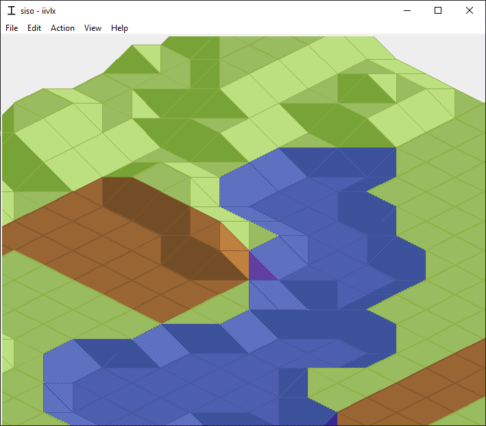

# sisopy

**S**imple **Iso**metrics in **Py**thon.

## Controls

You can pan the camera by left clicking and dragging.

You can raise/lower terrain by right clicking on a tile. You can select between raising and lowering in the "Action" menu.

